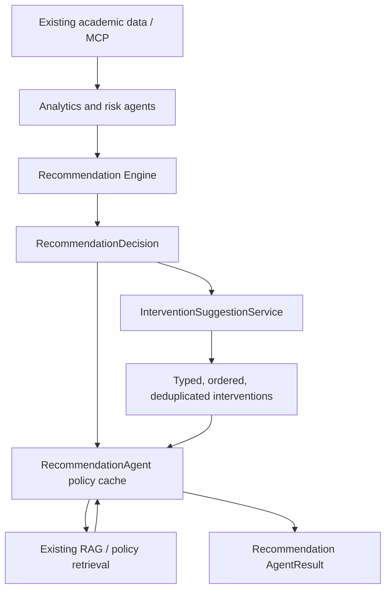

# Intervention suggestions (Issue #112)

## Purpose and boundary

Intervention generation answers one narrow question: given an already-approved
recommendation decision, what concrete action can the tutor take?

`InterventionSuggestionService` is a deterministic application service. It
consumes the typed decisions produced by the Issue #110 Recommendation Engine
and classifies their existing actionable wording. It does not inspect raw
student records, recalculate analytics or risk, retrieve policy, invoke an LLM,
or create recommendations.

Recommendations state the approved kind of tutor support and retain the
academic decision. Interventions expose its concrete action under a stable
machine-readable type. The service reuses recommendation actions rather than
creating competing action wording.

## Contracts

`InterventionInput` contains:

- `student_id`;
- upstream `COMPLETE` or `PARTIAL` data status;
- typed `RecommendationDecision` objects;
- upstream unavailable dimensions.

Each `InterventionSuggestion` contains:

- `intervention_type`;
- the existing recommendation priority and action;
- originating reason codes;
- student evidence and source-agent provenance;
- the originating policy query.

`InterventionAssessment` contains the suggestions, data status, unavailable
dimensions, and any recommendation reasons that have no approved intervention
mapping.

## Intervention taxonomy and triggers

| Recommendation reason code | Intervention type | Academic purpose |
|---|---|---|
| `NO_CONFIRMED_RISK_CONTINUE_MONITORING` | `MONITOR_PROGRESS` | Avoid unnecessary high-touch action while retaining normal monitoring. |
| `PROGRESS_REVIEW_STUDY_PLAN` | `REVIEW_STUDY_PLAN` | Review the plan when verified progress evidence requires attention. |
| `PROGRESS_SCHEDULE_TUTOR_MEETING` | `SCHEDULE_TUTOR_MEETING` | Arrange direct tutor review for elevated progress concern. |
| `STUDY_RIGHT_REVIEW_SUPPORT_OPTIONS` | `REVIEW_STUDY_RIGHT` | Review remaining study-right and support options. |
| `ACADEMIC_DEADLINE_REVIEW_NEXT_STEP` | `REVIEW_ACADEMIC_DEADLINE` | Agree on the next step for an applicable deadline. |

Unknown reason codes do not create generic or invented actions. Contact,
referral, and recovery-plan interventions are intentionally absent until an
approved recommendation decision supports them.

## Priority, ordering, and deduplication

Intervention priority is the originating recommendation priority; there is no
parallel priority scale. Suggestions are ordered `CRITICAL`, `HIGH`, `MEDIUM`,
then `LOW`, followed by stable taxonomy order.

If multiple decisions trigger the same intervention type, only one suggestion
is returned. It retains the highest supplied priority and merges unique reason
codes, evidence, and source agents. This produces the smallest useful action
set without losing provenance.

## Evidence and partial data

Student evidence is passed through from the recommendation decision without
recalculation. The service never infers facts from absent fields. In particular,
an unavailable `tutor_meetings` dimension is not interpreted as evidence that
the student has had no meetings and cannot trigger a meeting intervention.

A partial upstream assessment remains partial. Confirmed decisions may still
produce actions, while unavailable dimensions remain in both the intervention
assessment and the enclosing Recommendation Agent result.

## Policy and agent integration

`RecommendationAgent` invokes the service immediately after
`RecommendationEngine`. It stores serialized suggestions in
`AgentResult.data["interventions"]`; no new agent route or shared-state field is
required.

The agent retrieves policy once per unique recommendation query and reuses the
same verified chunks for matching interventions. The intervention service does
not call RAG. Missing policy produces no fabricated source; the intervention
may remain as a structured fact-based action while the agent result is partial.
Explicitly conflicting policy suppresses both the affected recommendation and
its intervention.

## Deterministic and non-responsibilities

Intervention classification, priority, ordering, deduplication, reason mapping,
and evidence preservation are deterministic. No LLM is required.

Issue #112 does not implement recommendation generation (#111), risk or
progress explanations (#113/#114), recommendation templates (#115), or quality
evaluation (#116). It also does not replace the workflow-specific offline
adapter used by weekly tutor briefings.
