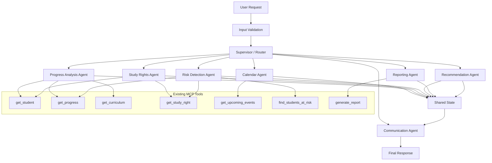
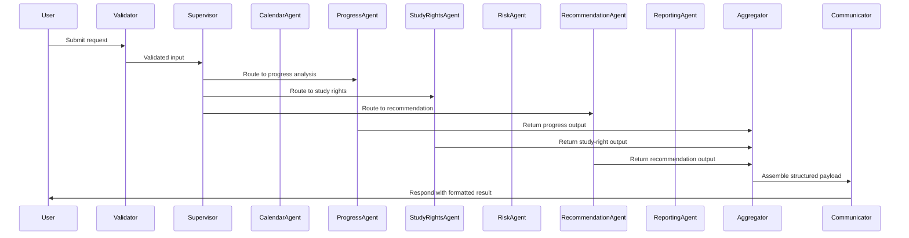

# Multi-Agent Architecture for AI Academic Copilot

> Historical agent-design document. For the implemented end-to-end system,
> including Telegram, FastAPI, MCP/data, RAG, persistent memory, and autonomous
> workflows, see [Academic Copilot system architecture](system-architecture.md).

## 1. Architecture overview

The multi-agent architecture defines a supervised LangGraph workflow for tutor-facing academic tasks. It separates responsibilities into:

- Input validation
- Supervisor routing
- Specialized academic agents
- Result aggregation
- Communication formatting
- MCP tool access for relational data

This design keeps academic business logic out of LLM/prompt logic and avoids direct database access inside agents. All relational student data is retrieved through MCP tools.

## 2. Design goals

- Use LangGraph for workflow orchestration.
- Keep agents focused, loosely coupled, and deterministic.
- Route tasks through a supervisor rather than agent-to-agent calls.
- Store only typed shared state for collaboration.
- Preserve structured, testable outputs.
- Avoid direct SQL and repository access in the agent layer.
- Support deterministic testing without real LLM dependencies.

## 3. Component responsibilities

- **Input Validation**: Normalize incoming requests, validate student identifiers, and determine the desired route or intent.
- **Supervisor / Router**: Select one or more appropriate agents, decide execution order, guard unsupported workflows, and assemble shared state.
- **Specialized Agents**: Perform academic analysis through MCP tools and emit structured, evidence-backed results.
- **Result Aggregator**: Collect agent outputs, merge warnings and errors, and build a stable intermediate representation.
- **Communication Agent**: Format the final response for Telegram or API clients without introducing new domain analysis.
- **MCP Tool Layer**: Provide access to relational academic data through existing tools such as `get_student`, `get_progress`, and `generate_report`.
- **Persistence Layer**: PostgreSQL and existing repositories remain behind the MCP tool layer only.

## 4. Agent responsibility matrix

| Agent | Primary responsibility | Inputs | Outputs | Notes |
|---|---|---|---|---|
| Calendar Agent | Upcoming events, deadlines, tutor planning | `get_upcoming_events`, RAG calendar knowledge | event schedule, planning notes, warnings | Uses MCP-only event data for relational facts. |
| Progress Analysis Agent | ECTS completion, progress status | `get_student`, `get_progress`, `get_curriculum`, `get_student_dashboard` | progress summary, curriculum alignment, gaps | Should not reimplement progress or curriculum rules.|
| Study Rights Agent | Study-right status and timelines | `get_student`, `get_study_right` | study-right status, expiration context | Maps study-right state into tutor-facing explanation. |
| Risk Detection Agent | Academic risk detection | `find_students_at_risk`, `get_progress`, `get_study_right`, `get_student_dashboard` | risk findings, risk evidence, risk category | For Issue #79 this remains an architecture stub; actual risk logic will be encapsulated in future issue agents. |
| Recommendation Agent | Actionable recommendations | structured results from other agents | recommendations with evidence and reason | Consumes agent outputs instead of raw tool data when possible. |
| Reporting Agent | Structured reports and summaries | `generate_report`, structured agent outputs | student report, cohort summary, report sections | Uses existing report service/tool contracts. |
| Communication Agent | Final response formatting | aggregated agent results | client-ready payload | Must preserve academic facts, warnings, and uncertainty. |

## 5. Agent-to-tool mapping

- `Calendar Agent` → `get_upcoming_events`, RAG retrieval for calendar policies only
- `Progress Analysis Agent` → `get_student`, `get_progress`, `get_curriculum`, `get_student_dashboard`
- `Study Rights Agent` → `get_student`, `get_study_right`
- `Risk Detection Agent` → `find_students_at_risk`, `get_progress`, `get_study_right`, `get_student_dashboard`
- `Recommendation Agent` → structured outputs from other agents (not raw SQL)
- `Reporting Agent` → `generate_report`, plus structured agent findings
- `Communication Agent` → aggregated workflow result only

## 6. LangGraph workflow description

LangGraph will orchestrate the workflow as a directed node graph. The supervisor is the entry node, responsible for route selection and safe termination.

A canonical workflow:

1. `validate_request`
2. `supervisor_router`
3. `specialized_agent(s)`
4. `result_aggregator`
5. `communication_formatter`
6. `final_response`

The supervisor may dispatch one agent or a small sequence of agents depending on the request intent. Independent agents should be parallelizable in the future.

## 7. Supervisor routing model

The supervisor decides the route using:

- explicit command names or intents,
- deterministic fallback rules,
- supported route whitelist,
- maximum workflow depth protections.

Routing must support:

- single-agent requests like `progress`
- sequential workflows like `risk` → `recommendation`
- combined workflows like `reporting` using multiple agent outputs
- unsupported-request rejection with a clear structured error

Example route names:

- `calendar`
- `progress`
- `study_rights`
- `risk`
- `recommendation`
- `reporting`
- `communication`
- `finish`

The supervisor should never allow an unbounded loop. A maximum step counter or explicit route termination marker guards the workflow.

## 8. Shared state conceptual design

Shared state is a typed object passed between LangGraph nodes. It must be serializable and limited to the current request lifecycle.

Core shared state fields:

- `request_id`: unique workflow identifier
- `intent`: user intent or explicit command
- `route`: selected route name
- `student_id`: normalized student identifier, if applicable
- `parameters`: raw request inputs
- `agent_outputs`: per-agent structured results
- `warnings`: workflow-level warnings
- `errors`: workflow-level errors
- `metadata`: telemetry and routing hints

Agents do not mutate each other directly. They append their result into the shared `agent_outputs` collection.

## 9. Structured agent-result design

Each agent returns a structured result object with a stable contract:

- `agent_name`: unique agent identifier
- `route`: selected route name
- `status`: `SUCCESS`, `WARNING`, `FAILED`, `PARTIAL`, or `UNKNOWN`
- `summary`: brief tutor-facing summary
- `data`: agent-specific structured payload
- `evidence`: list of deterministic evidence strings
- `warnings`: agent-level warnings
- `errors`: agent-level errors
- `timestamp`: optional execution timestamp

This contract enables the aggregator and communication layer to safely merge results.

## 10. Error-handling strategy

The architecture should distinguish between failures that end the workflow and partial failures that preserve usable output.

Handle these cases explicitly:

- **Invalid request**: terminate early with `unsupported_route` or `invalid_input`.
- **Student not found**: return a structured error and avoid downstream analysis.
- **MCP tool error**: record agent-level `DATABASE_ERROR` and continue only if safe.
- **Missing optional data**: emit partial results and warnings, e.g. missing curriculum or study-right data.
- **Agent failure**: preserve other agent outputs and include failure details in the final response.
- **Unsupported route**: supervisor returns a rejection response.
- **Maximum iterations exceeded**: terminate with a clear workflow-level failure.

An individual agent failure should not force a complete workflow failure when other agents can still contribute.

## 11. Observability and logging strategy

Structured logs should capture:

- `request_id`
- `conversation_id`
- `telegram_user_id` or client identifier
- `student_id`
- `agent_name`
- `route`
- `tool_name`
- `execution_status`
- `duration_ms`
- `error_code`

Avoid logging sensitive academic records, full prompts, or raw user messages unless required for debugging with explicit redaction.

## 12. Testing strategy

The architecture should support:

- agent unit tests with mocked MCP clients and deterministic inputs
- supervisor routing tests for explicit intents and fallback rules
- shared-state validation tests for required fields and invalid transitions
- workflow integration tests using LangGraph node stubs instead of a real LLM
- partial failure tests where one agent returns warnings or errors
- maximum-step protection tests ensuring the workflow terminates safely
- final response aggregation tests verifying warnings, errors, and data preservation

No architecture-level tests should require calls to a production LLM API.

## 13. Security and privacy considerations

- Do not expose raw database records through agent outputs.
- Use MCP tools for all relational student data.
- Avoid embedding Telegram-specific logic inside analytical agents.
- Keep shared state ephemeral and request-scoped.
- Limit RAG usage to unstructured academic policies or calendar documents, never relational student records.

## 14. Architecture decisions and trade-offs

- **Supervisor-based workflow**: chosen to keep agent collaboration explicit and deterministic.
- **Typed shared state**: reduces coupling and enables later memory or stateful coordination.
- **No direct DB access in agents**: preserves existing data encapsulation and MCP contract boundaries.
- **Communication agent as final formatter**: keeps analysis separate from presentation.
- **No autonomous agent loops**: protects against runaway workflows and simplifies deterministic testing.
- **Lightweight Python interfaces**: provide future implementation contracts without overengineering.

## 15. Mermaid architecture diagram

## 16. Mermaid workflow sequence diagram

## 17. Recommended implementation order for Issues #80–#89

1. **Issue #80 — Supervisor and shared state**: implement the LangGraph supervisor, route model, shared state contracts, and deterministic fallback.
2. **Issue #81 — Calendar Agent**: build the calendar agent and integrate with `get_upcoming_events` plus RAG calendar knowledge.
3. **Issue #82 — Progress Analysis Agent**: implement progress analysis using `get_student`, `get_progress`, `get_curriculum`, and `get_student_dashboard`.
4. **Issue #83 — Study Rights Agent**: implement study-right analysis with `get_student` and `get_study_right`.
5. **Issue #84 — Risk Detection Agent**: add risk detection using `find_students_at_risk` and supporting progress/study-right inputs.
6. **Issue #85 — Recommendation Agent**: consume structured agent outputs to produce evidence-based recommendations.
7. **Issue #86 — Reporting Agent**: wire in `generate_report` and agent-based report composition.
8. **Issue #87 — Shared state validation**: add schema validation, required field checks, and safe state transitions.
9. **Issue #88 — Agent-memory boundaries**: define short-term request memory and prevent long-term state in LangGraph.
10. **Issue #89 — Collaboration testing**: build deterministic workflow tests, partial-failure tests, and supervisor route coverage.

---

### Existing proof-of-concept

A lightweight PoC already exists at `backend/app/research/langgraph_poc.py`. That file demonstrates the conceptual graph pattern, but the production architecture should move into `backend/app/agents` with typed agents, supervisor routing, and a LangGraph-driven orchestration layer.
