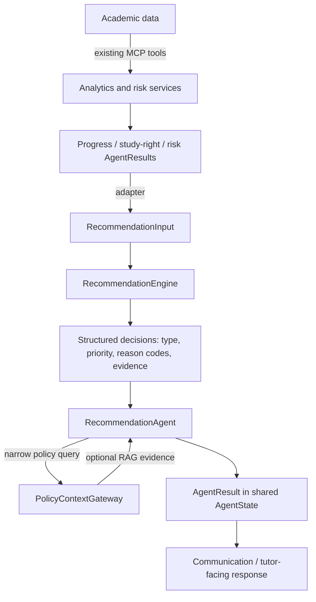

# Recommendation Engine architecture (Issue #110)

## Purpose and boundary

The Recommendation Engine is a deterministic application/domain component
that converts structured, pre-calculated academic evidence into structured
tutor-action decisions. It is implemented in
`backend/app/services/recommendation_engine.py` and is usable without
LangGraph, MCP, RAG, a database, or an LLM.

The engine owns:

- approved mappings from academic risk dimensions to advisory action types;
- priority gates for those mappings;
- stable reason codes;
- preservation of evidence provenance and data-completeness status.

The engine does **not** calculate ECTS, expected progress, delay, study-right
status, academic risk scores, or event applicability. Those facts remain owned
by the existing analytics and risk services. It does not retrieve policy, call
MCP tools, write prompts, generate natural-language explanations, or format a
tutor response.

## Existing components and responsibilities

| Component | Responsibility in the recommendation flow |
|---|---|
| Analytics and risk services | Produce authoritative progress, delay, study-right, event, and risk evidence. |
| MCP and `AcademicToolGateway` | Access structured academic data without exposing repositories to agents. |
| `RecommendationEngine` | Map normalized evidence to deterministic recommendation decisions. |
| `RagIntegrationService` / `PolicyContextGateway` | Retrieve optional institutional guidance; never calculate student facts. |
| `RecommendationAgent` | Adapt shared agent results, invoke the engine, retrieve policy context, and return an `AgentResult`. |
| LangGraph workflow | Execute selected agents in order and preserve results in `AgentState`. |
| LLM / communication layer | Future presentation of approved structured decisions; it must not invent facts or rules. |

No second recommendation agent, risk scorer, retriever, vector store, or MCP
tool is introduced by Issue #110.

## Decision flow

1. Existing services and agents determine academic facts.
2. `RecommendationAgent` validates that risk ran first and adapts its structured
   output into `RecommendationInput`.
3. `RecommendationEngine.evaluate` applies explicit mappings and produces
   `RecommendationDecision` objects.
4. The agent optionally retrieves relevant institutional context for each
   unique policy query. Retrieval failure does not change academic facts or
   cause the engine to invent policy.
5. The agent stores decisions, warnings, unavailable dimensions, and policy
   evidence in the normal `AgentResult` under the `recommendation` route.

## Contracts and explainability

`RecommendationInput` contains the student identifier, upstream risk level,
risk factors, `COMPLETE`/`PARTIAL` data status, unavailable dimensions, and
optional supporting evidence from prior agents. It intentionally contains no
raw repositories, tool clients, prompts, or database sessions.

Each `RecommendationDecision` contains:

- `recommendation_type` (also exposed as legacy `category` by the agent);
- `priority`, inherited from authoritative risk evidence;
- an approved advisory `action`;
- stable `reason_codes` describing the matched rule;
- structured evidence and `source_agents` provenance;
- an internal narrow policy query used only by the agent's RAG adapter.

The assessment retains `data_status`, `unavailable_dimensions`, and
`missing_information`. Missing evidence is never interpreted as a safe or
zero-risk result. RAG evidence is stored separately from student evidence, so
institutional context cannot be mistaken for a calculated student fact.

## Current integration and extension points

The existing `RecommendationAgent` remains registered in the LangGraph
workflow and now delegates deterministic mapping to the engine. Existing
progress and study-right agent results are attached as supporting provenance;
the risk result remains the required decision input.

The later Epic #109 issues can extend this boundary without moving business
rules into prompts:

- #111 can add additional approved recommendation mappings or application
  adapters around the same input/output contract.
- #112 can model intervention options associated with reason codes.
- #113 and #114 can render explanations from retained evidence and provenance.
- #115 can map structured decisions into tutor-facing templates.
- #116 can evaluate decision quality using deterministic fixtures and recorded
  evidence, without requiring a production LLM.

Any future canonical risk-score or tutor-meeting adapter should normalize its
existing result into `RecommendationInput`; it must not be recalculated inside
the engine.

## Tutor recommendation generation (Issue #111)

Issue #111 uses the Issue #110 contracts without adding another service or
agent. Personalization is the deterministic selection of an approved decision
from the student's structured risk factors and the preservation of the exact
factor values as evidence. Recommendation generation does not recalculate
ECTS, expected progress, study-right status, risk, meetings, or events.

The currently supported situations are:

| Verified situation | Deterministic recommendation behavior |
|---|---|
| Complete assessment with no confirmed risk | Return a low-priority normal-monitoring decision and state that no immediate intervention is required. |
| Progress concern | Recommend study-plan review; medium or higher priority also recommends a tutor meeting. |
| Study-right concern | Recommend reviewing extension or support options. |
| Applicable academic deadline | Recommend reviewing the deadline and agreeing on the next step. |

The healthy-student decision is emitted only when the upstream assessment is
`COMPLETE`, the risk level is `NONE`, and no risk factors exist. A partial
assessment with no confirmed factors is inconclusive and must not be presented
as evidence that the student is healthy.

For every generated decision, `RecommendationAgent` issues the decision's
narrow policy query through the existing `PolicyContextGateway`. Retrieved
chunks are attached as `policy_evidence`, separately from student evidence. If
retrieval fails or returns no usable source, the fact-based recommendation may
still be returned, but the agent result is `PARTIAL` and explicitly says that
the action is not a statement of university policy. Policy text is never
invented.

No LLM participates in Issue #111. Academic facts, decision triggers,
priorities, reason codes, evidence selection, and completeness are all
deterministic. A later presentation feature may phrase the structured result
for tutors but must not override it.
