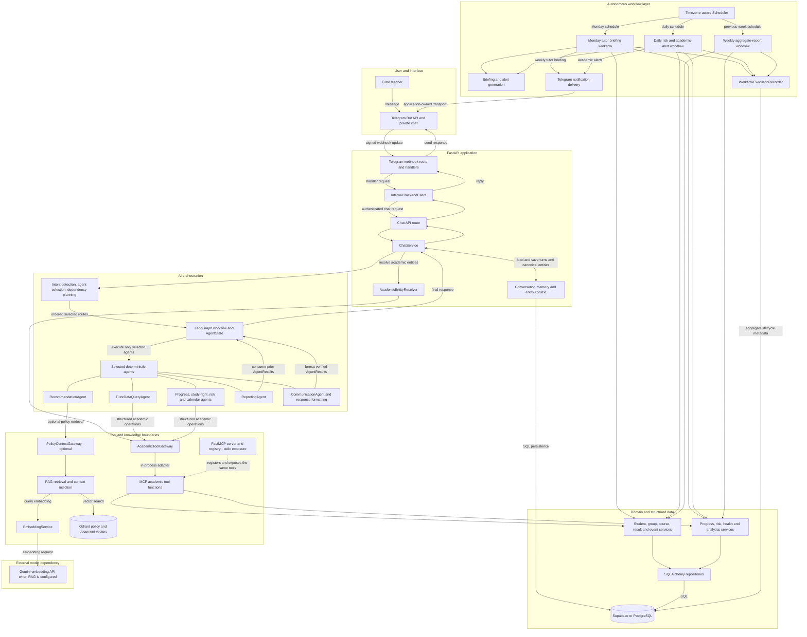
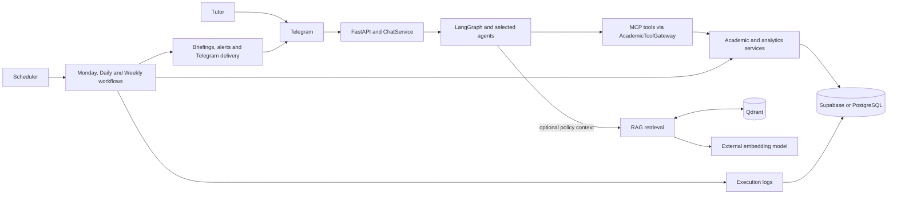

# Academic Copilot system architecture

This is the high-level source of truth for the implemented architecture. It
shows tutor-initiated conversations and system-initiated workflows; detailed
component documents remain authoritative for their individual contracts.

## System diagram

`MCPAcademicToolGateway` invokes MCP tool functions in-process on worker
threads. `FastMCP` registers those same functions for a separate stdio server;
the gateway does not make a fictitious network hop through that server.

## Presentation view

No answer-generation LLM is invoked by the current production agent workflow.
Agents, risk rules, recommendations, reports, and templates are deterministic.
The configured external model integration supplies Gemini embeddings for the
optional RAG pipeline.

## Conversational request flow

1. Telegram posts a signed update to the FastAPI webhook route.
2. The handler sends an authenticated request through `BackendClient` to
   `/api/v1/chat/messages` and later sends the returned reply to Telegram.
3. `ChatService` loads PostgreSQL-backed memory, detects intent, resolves
   academic entities, merges canonical context, and creates an agent plan.
4. LangGraph executes only the ordered selected agents against `AgentState`.
5. Academic agents use `AcademicToolGateway`; MCP tool functions call domain
   services and repositories rather than exposing database sessions to agents.
6. `RecommendationAgent` may request policy context through
   `PolicyContextGateway`. Without configured RAG, the explicit unavailable
   gateway preserves partial-result semantics.
7. The workflow/formatter returns the response. `ChatService` persists a
   successful or partial turn and its STUDENT, STUDENT_GROUP, COURSE, and
   TEACHER context before the handler replies.

The chat API can also be called by another authorized client; Telegram is the
principal demonstrated interface, not a requirement of `ChatService`.

## Autonomous workflow flow

1. FastAPI lifespan starts the scheduler only when enabled and registers
   Monday, Daily, and Weekly jobs with configured timezones.
2. Monday discovers active tutors and assigned students, consumes
   progress/risk/event services, renders briefings, and delivers them through
   the lifecycle-owned Telegram sender.
3. Daily runs automatic risk detection, alert generation, and authorized
   Telegram alert delivery.
4. Weekly calculates and persists aggregate previous-week reports; it does not
   send tutor briefings.
5. Execution recorders store aggregate lifecycle status, counts, timing, and
   safe error metadata in PostgreSQL.

Autonomous workflows call domain services/repositories directly. They do not
route through ChatService, LangGraph, or MCP because they are server-side
application orchestrators rather than agent tool consumers.

## Component responsibilities

| Component | Responsibility |
|---|---|
| Telegram | Tutor interface and transport for replies and proactive notifications. |
| FastAPI routes | Authenticate Telegram webhooks/internal chat calls and expose APIs. |
| `ChatService` | Coordinate intent, entity resolution, context, planning, workflow execution, and persistence. |
| Conversation memory | Persist bounded turns and canonical entities per authorized conversation scope. |
| Router/planner | Select a supported route and expand only its declared dependencies. |
| LangGraph and `AgentState` | Execute the ordered plan and carry typed state/results. |
| `TutorDataQueryAgent` | Run resolved student, group, course, result, and teacher queries. |
| Analysis agents | Produce progress, study-right, risk, and calendar results from tools. |
| `RecommendationAgent` | Map verified risk evidence to actions and optionally retrieve policy context. |
| `ReportingAgent` | Assemble prior verified results into a structured tutor report. |
| `CommunicationAgent` | Render available verified results and recommendations when selected. |
| `AcademicToolGateway` | Async validated boundary between agents/entity resolution and academic tools. |
| MCP tools/server | Tool functions adapt services; FastMCP registers them for stdio exposure. |
| Academic services | Own student, group, course, result, assignment, study-right, and event behavior. |
| Analysis services | Own deterministic progress, delay, risk, health, and analytics calculations. |
| Repositories | Perform SQL access and map rows into service inputs. |
| Supabase/PostgreSQL | Store authoritative academic, assignment, conversation, report, and log data. |
| `PolicyContextGateway` | Separate optional policy retrieval from student facts. |
| RAG/Qdrant | Embed queries and retrieve policy/document chunks from the vector index. |
| Gemini embedding API | Configurable RAG embeddings; not answer generation. |
| Scheduler | Trigger registered timezone-aware jobs during FastAPI lifespan. |
| Autonomous workflows | Reuse domain logic for briefings, risk/alerts, and reports. |
| Telegram notification delivery | Send already-rendered workflow messages to authorized destinations. |
| Workflow execution logging | Persist privacy-safe aggregate execution metadata. |

## Architectural boundaries

- Agents/entity resolution do not open database sessions or query PostgreSQL
  directly; structured agent data crosses gateway/tool/service boundaries.
- MCP tools adapt services, services own domain behavior, and repositories own
  SQL. LangGraph coordinates execution rather than replacing those layers.
- Risk, health, progress, recommendation decisions, and templates are
  deterministic. Missing evidence retains COMPLETE, PARTIAL, UNAVAILABLE, or
  UNPROCESSABLE semantics.
- RAG knowledge is optional and cannot override canonical academic facts.
- Telegram transport is outside agents/domain services. Workflows hand rendered
  messages to the configured notification sender.
- Autonomous workflows reuse services/repositories but are not conversational
  agent requests.

## Data classification

### Authoritative structured data

Supabase/PostgreSQL stores students, programmes, groups, courses, enrollments,
completions/results, teachers/tutors, assignments, study rights, meetings,
events, curriculum, weekly reports, conversation memory, and workflow history.

### Knowledge and RAG data

Policies, documentation, and guidance are loaded, chunked, embedded, and
indexed in Qdrant. Query-time RAG returns attributed supporting context. Qdrant
does not store or replace canonical student academic records.

### Conversation state

Production `SQLAlchemyConversationMemoryStore` persists bounded messages and
resolved canonical entity snapshots in PostgreSQL by conversation/owner scope.
Tests can inject an in-memory implementation. `AgentState` is per-execution
state, not the durable conversation database.

## Current limitations and configuration notes

- The default workflow uses `UnavailablePolicyContextGateway`; production RAG
  needs an explicit `RagPolicyContextGateway` composition not currently wired
  in the default `ChatService` singleton.
- The repository contains an LLM-ready context pipeline, but no
  answer-generation LLM call in the production chat workflow.
- The in-process scheduler is disabled by default. Deployment must enable it
  and ensure only the intended application process owns scheduled execution.
- Monday delivery has no durable per-recipient deduplication key; execution logs
  audit runs but do not suppress repeated manual sends.
