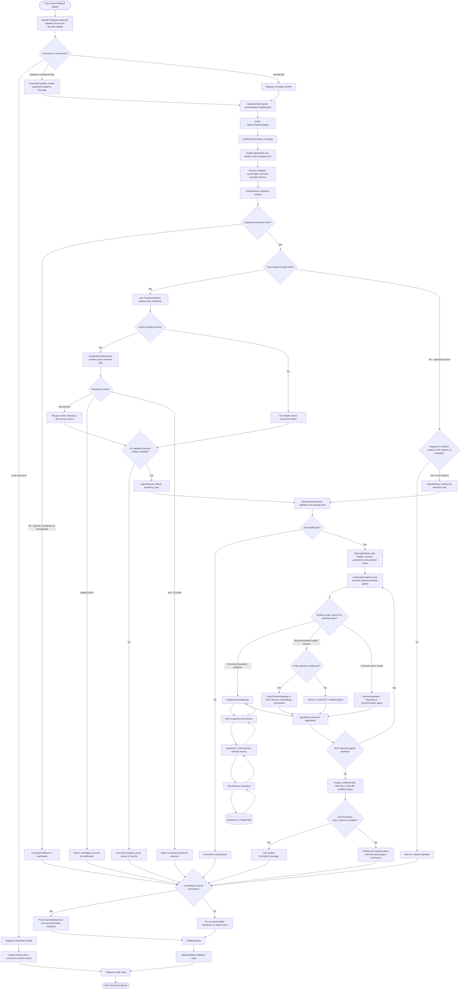
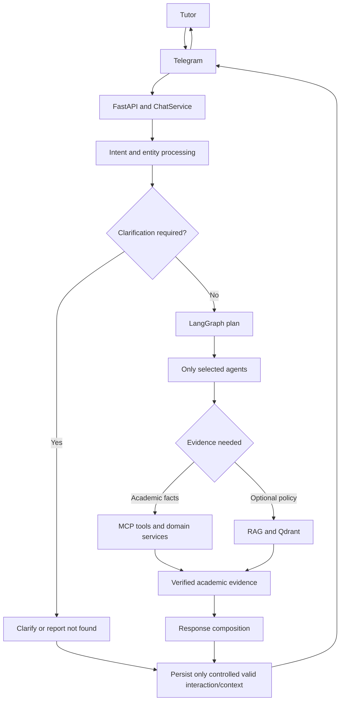

# Academic Copilot system workflow

This document is the runtime and decision view of one tutor request. The
[system architecture](system-architecture.md) is the structural component view;
this workflow shows which branches actually execute from Telegram input to
Telegram response.

## Detailed request workflow

The structured-data and RAG branches are alternatives selected by agent need.
RAG is not called for ordinary academic queries and never stores student facts.
The production default currently uses `UnavailablePolicyContextGateway`, so
recommendations remain evidence-based but may be explicitly partial when policy
context is unavailable.

## Presentation workflow

## Workflow steps

| Step | Component | Responsibility | Possible outcome |
|---:|---|---|---|
| 1 | Telegram webhook | Validate the webhook secret and decode the update. | Accepted, disabled, forbidden, or malformed. |
| 2 | Command/message handler | Handle local commands or forward a tutor message. | Direct reply or backend request. |
| 3 | `BackendClient` | POST an authenticated `ChatRequest` to the chat API. | Valid reply or controlled connectivity error. |
| 4 | Chat API | Establish trusted-Telegram status and call `ChatService`. | Trusted or ordinary application request. |
| 5 | Session and memory | Update session metadata; resolve/load bounded conversation state. | Stored messages/entities or safe empty context after load failure. |
| 6 | `IntentDetector` | Match specialized routes or `TutorQueryMatch`. | Academic route, general fallback, ambiguity, or unsupported request. |
| 7 | `AcademicEntityResolver` | Resolve explicit STUDENT, STUDENT_GROUP, COURSE, or TEACHER references. | RESOLVED, AMBIGUOUS, or NOT_FOUND. |
| 8 | Context merge | Replace successfully resolved types and preserve unrelated canonical types. | Complete context or missing requirement. |
| 9 | Selector/planner | Validate the root route and expand declared dependencies. | Ordered routes or controlled routing failure. |
| 10 | `AgentState`/LangGraph | Execute only pending selected agents and retain `AgentResult` values. | SUCCESS, PARTIAL, SKIPPED, or FAILED agent results. |
| 11 | Academic tools | Run structured operations through gateway, MCP tool, service, and repository boundaries. | Verified payload or controlled tool error. |
| 12 | Optional policy path | Retrieve institutional guidance for recommendations when configured. | Attributed evidence or explicit unavailable context. |
| 13 | Response composition | Use `CommunicationAgent` output when present; otherwise format agent summaries. | Completed, partially completed, or failed response. |
| 14 | Memory persistence | Save completed/partial turns and canonical entity snapshots. | Durable context or best-effort persistence warning. |
| 15 | Telegram handler | Send the validated API reply back to the originating chat. | Tutor reply or logged Telegram/backend error. |

## Key decision points

| Decision | Yes / success | No / failure |
|---|---|---|
| Is the update a local Telegram command? | The command handler may answer directly. | Normal or academic-alias messages use `BackendClient`. |
| Is the intent supported? | Select its registered academic route. | Return general, clarification, unsupported, or routing fallback. |
| Are explicit academic entities present in a tutor-data query? | Resolve every explicit reference for the current turn. | Reuse only capability-eligible stored context. |
| Is an explicit entity uniquely resolved? | Merge it, replacing only the same entity type. | AMBIGUOUS/NOT_FOUND stops academic execution and returns a controlled response. |
| Can stored context satisfy omitted entities? | Continue with canonical context. | Ask for the missing student/group/course/teacher. |
| Did the current message explicitly request an unresolved replacement? | Never use stale same-type context for that request. | Previous valid context remains stored for a later valid follow-up. |
| Is the route registered and dependency plan valid? | Build `AgentState` and execute the ordered plan. | Return an internal routing fallback without running agents. |
| Does an agent require academic facts? | Use gateway → MCP tool → service → repository → PostgreSQL. | Agents that consume prior results do not repeat data access. |
| Is policy/RAG configured and evidence usable? | Attach attributed policy context to recommendations. | Mark policy context unavailable; never fabricate policy evidence. |
| Did all selected agents succeed? | Workflow becomes COMPLETED. | Any usable success/partial result can produce PARTIAL; otherwise FAILED. |
| Is clarification required? | Return it before LangGraph/domain execution. | Continue only when required context and routing are valid. |
| Is the interaction completed or partial? | Persist the turn and entity snapshot. | Failed interactions are not saved as valid conversation context. |

## Multi-turn context and precedence

Conversation context stores canonical identities, not guesses:

1. `Show me Matias Multiple.` resolves the STUDENT to Matias Multiple,
   `DEMO25204`, and stores the canonical ID in the Telegram conversation scope.
2. `How is he progressing?` is a specialized progress intent without an
   explicit student reference. `ChatService` supplies the stored STUDENT to
   `AgentState`; `ProgressAnalysisAgent` uses that canonical ID.
3. `Did Oskari Example pass DII101?` contains an explicit STUDENT and COURSE.
   Successful resolution replaces Matias only for the STUDENT type and adds or
   replaces COURSE; unrelated group/teacher context remains unchanged.
4. If the explicit replacement is ambiguous or not found, the current request
   stops at clarification/not-found. It does not silently answer about Matias.
   The last valid Matias context remains available for a later request.

## Example: Student progress follow-up

1. Tutor sends `Show me Matias Multiple.`
2. `TutorQueryMatch` selects `student_lookup` with an explicit STUDENT reference.
3. `AcademicEntityResolver` finds canonical student `DEMO25204`.
4. `TutorDataQueryAgent` retrieves the profile through the academic gateway and
   MCP/service/repository path.
5. The successful turn persists Matias as active STUDENT context.
6. Tutor sends `How is he progressing?` in the same Telegram chat.
7. The progress intent requires a STUDENT; stored context supplies Matias.
8. LangGraph executes `ProgressAnalysisAgent`, which obtains progress through
   `AcademicToolGateway` and the progress MCP tool.
9. `ProgressService` reports 5 completed ECTS against 30 expected: 25 ECTS
   behind, BEHIND, and 16.7% of expected progress.
10. `ChatService` renders and persists the response; Telegram returns it.

## Example: Ambiguous entity

An established test case uses `Anna`, because multiple students match it:

1. Assume Matias is the previously active STUDENT.
2. Tutor sends `Did Anna pass DII101?`.
3. The message explicitly supplies STUDENT `Anna` and COURSE `DII101`.
4. `AcademicEntityResolver` returns AMBIGUOUS for STUDENT and candidate details.
5. `ChatService` asks which matching student is intended.
6. LangGraph, MCP tools, and result services do not execute for this request.
7. The system does not answer using stale Matias context. Matias remains the
   last valid context only for a later request that does not contain a failed
   explicit replacement.

`Oskari Example` itself is unique in the deterministic demo data and is not an
ambiguity example.

## Agent routing behavior

LangGraph does not run every agent. `IntentDetector` identifies one root route,
`AgentSelector` verifies it is registered, and `DependencyResolver` expands the
declared prerequisites:

- `academic_data`, progress, study rights, risk, and calendar can run as roots.
- Recommendation adds risk as its prerequisite. `RiskDetectionAgent` retrieves
  its progress, study-right, and event evidence through the gateway.
- Reporting expands to progress, study rights, risk, recommendation, then
  reporting.
- Communication runs only when selected; otherwise `ChatService` formats the
  available agent summaries or rendered recommendation presentation.

The ordered routes, memory, resolved entities, parameters, results, warnings,
and errors travel through `AgentState`.

## Response and failure behavior

- **AMBIGUOUS:** list controlled candidate identifiers and request clarification.
- **NOT_FOUND:** return a controlled entity-specific not-found response.
- **Missing context:** ask for the required canonical entity before execution.
- **Unavailable academic evidence:** the responsible agent returns PARTIAL or
  FAILED according to its contract; missing evidence is not interpreted as safe.
- **Unavailable policy/RAG:** recommendations can remain fact-based but are
  qualified as partial and contain no fabricated policy citation.
- **Agent failure:** LangGraph retains errors; the final workflow becomes PARTIAL
  if usable results exist, otherwise FAILED.
- **Final response:** a valid `CommunicationAgent.formatted_message` takes
  precedence. Otherwise `ChatService` emits workflow-status wording plus
  tutor-facing summaries, including rendered recommendation content.
- **Persistence:** completed and partial interactions—including controlled
  clarification turns—are saved best-effort. Failed workflow interactions are
  not promoted into valid conversation context.

## Relation to autonomous workflows

This document covers the tutor-initiated request path. Scheduler-driven Monday,
Daily, and Weekly processing is summarized in the
[system architecture](system-architecture.md) and demonstrated in
[Demo Scenario 3](../demo/demo-scenario-3-autonomous-weekly-briefing.md).
